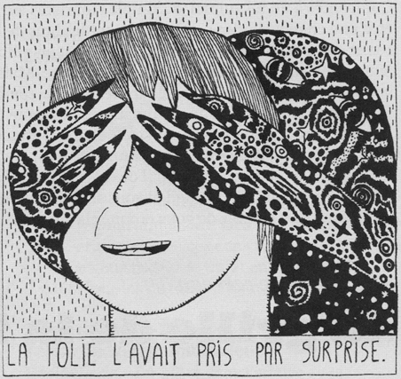

# about me
- unreasonably passionate about DL, mathematics and images.
- I cook, draw and train hard to set a good role model for my neural nets
- currently a Master's student at [NeuroPoly](https://neuro.polymtl.ca/) and one of the maintainers of [AxonDeepSeg](https://axondeepseg.readthedocs.io/)

here you will find thoughts about my research or interesting stuff I read

illustration by Hector de la Vallée