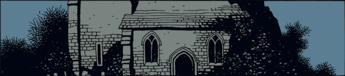
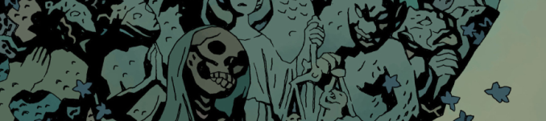

# homepage

words someone said:

 
refresh the page for more comical quotes
 
[[about me]](./about.html)

---

<h1>posts</h1>

this is what I have been up to lately


  <article>
    <h3>
      <a href="{{ post.url }}">
        {{ post.title }}
      </a>
    </h3>
    <time datetime="{{ post.date | date: '%Y-%m-%d' }}">{{ post.date | date_to_long_string }}</time>
    | <i> {{ post.abstract }} </i>
    <!-- {{ post.content }} -->
  </article>
  


